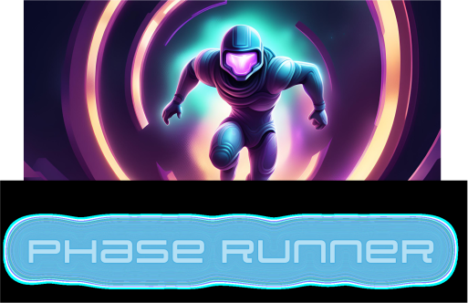

# Phase Runner

## Objective

Complete all levels in order without hitting any obstacles.

## Rules and Controls

Phase Runner controls:

- Press `<space>` to jump onto platforms and avoid obstacles, and
- Hold `<shift>` to temporarily phase through walls

As you use `<shift>`, the power bar at the bottom of the screen will slowly lose
energy. Once the energy bar reaches zero, you can no longer use `<shift>` to
phase. Use your power wisely to complete each level!

## Mechanics

- Player must not move in the x direction
- Background moves horizontally continuously until player dies
- Player moves vertically on space bar press
- Player opacity decreases on shift hold
- Player phases through walls on shift hold

## Game Assets

- Sound assets
  - Death sound when player in contact with obstacle
  - Background music that restarts on level start
  - Music to play during level and title screen
- Image assets
  - 5-7 frames/pictures of player for running animation
  - Reproducible platform image
  - Reproducible wall/obstacle image (different color, player dies on touch)
  - Scrolling background image
  - Level select screen
    - Background image
    - Level select buttons
  - Title screen
    - Game logo
    - Start button
    - Help button
  - Level complete screen
    - Back to level select button
  - Level end screen (game over)
    - Back to level select button
    - Try again button
- Game screens

  - Title screen
    - Start button
    - Help button
  - Level select screen
  - Level complete screen
  - Level end screen (game over)
  - Game completed screen (all levels completed)

## Flowchart

## Authors:

- [Connor Carpenter](https://github.com/connorcarpenter15)
- [Nicolas Crespo](https://github.com/n-crespo)

## Credits

Background Image: [FreePik](https://www.freepik.com/author/williamsantacruz)
Character Image: AI Generated
Walls and Obstacles Image: Free to Use Under Canva Free Media Licence (author unknown)
