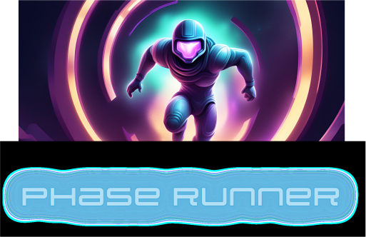

# Phase Runner



## Install

To install Phase Runner, simply clone the repository and use the following commands:

```sh
git clone git@github.com:senior-compsci-2022-2024/phase-runner-nicolas-connor.git
cd phase-runner-nicolas-connor/
python3 -m venv phase-runner-env
python3 main.py
```

## Usage

To play Phase Runner, simply use:

- `<space>` to jump onto platforms and avoid obstacles, and
- `<shift>` to phase through walls

As you use `<shift>`, the power bar at the bottom of the screen will slowly lose
energy. Once the energy bar reaches zero, you can no longer use `<shift>` to
phase. Use your power wisely to complete each level!

Win the game by completing all levels!

## Rules

- complete all levels in order

## Authors:

- [Connor Carpenter](https://github.com/connorcarpenter15)
- [Nicolas Crespo](https://github.com/n-crespo)
